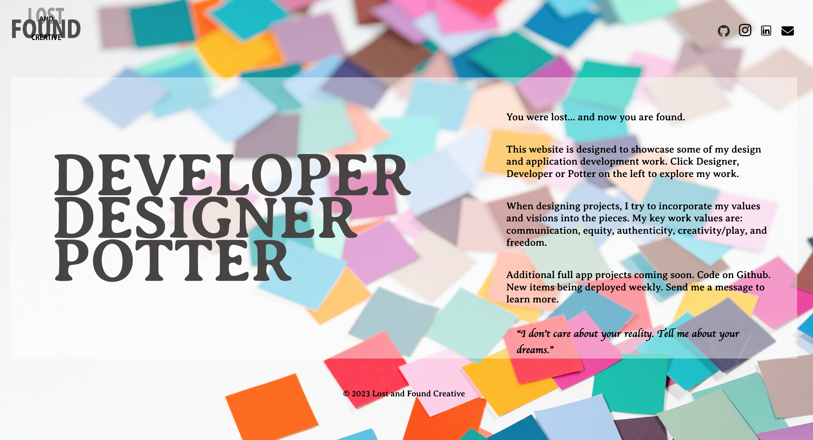
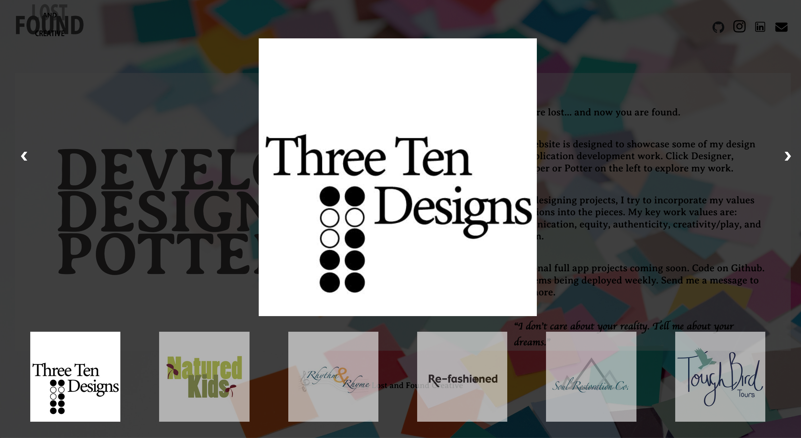

<h2> My Professional Portfolio</h2>

<h3>Built with:</h3>
<ul>
  <li>HTML </li> 
  <li>CSS (Flexbox)</li>
  <li>vanilla javascript</li> 
</ul>

<h3></h3>

<b>What I learned:</b>

<ul>
  <li>Event listeners</li>
  <li>Using Modals</li>
  <li>Responsive Layouts</li>
  <li>Accessible website implementation</li>

</ul>

<b>Continued development</b>

<b>I'd like to:</b>

Make the code a bit dryer to reduce repetition; maybe try use REACT
